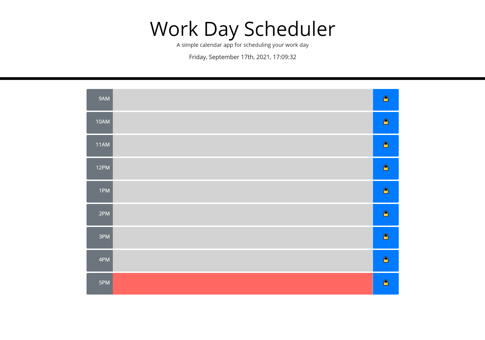

# work-day-scheduler

## Description
This website is an interactive schedule. You can add items to the text areas and save your input by click the blue save button on the right. The color of the text areas changes every hour. Gray for past, red for present, and green for future. This website was built using HTML, CSS and JavaScript as well as Bootstrap and jQuery.
## Table of Contents
- [Installation](#installation)
- [Usage](#usage)
- [How To Contribute](#how-to-contribute)
- [Tests](#tests)
## Installation
N/A
## Usage
Visit the website here: https://markcirineo.github.io/work-day-scheduler/

## How to Contribute
You can contact me here: markcirineo22@gmail.com
## Tests
N/A